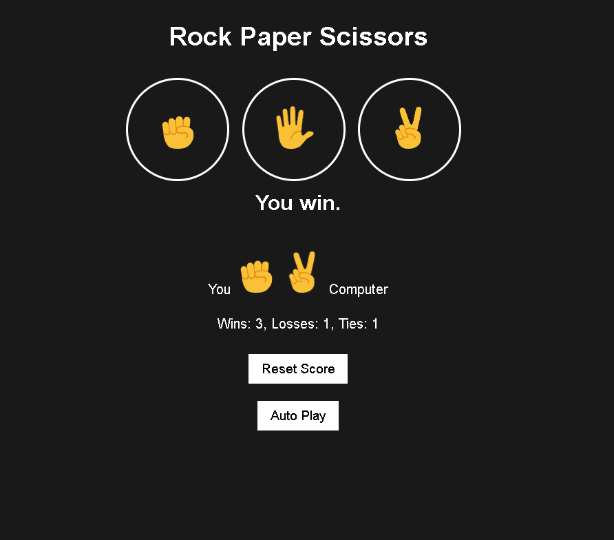

# Rock Paper Scissors!

## Description:
A fun traditional guessing game. 

## Win conditions:

Rock > Scissors 
Paper > Rock 
Scissors > Paper 

Note: The player wins the game by choosing the option before the ">" symbol.

## Keyboard input:
r - Rock 
p - Paper 
s - Scissors 
a - Auto play 
Backspace - Reset 

